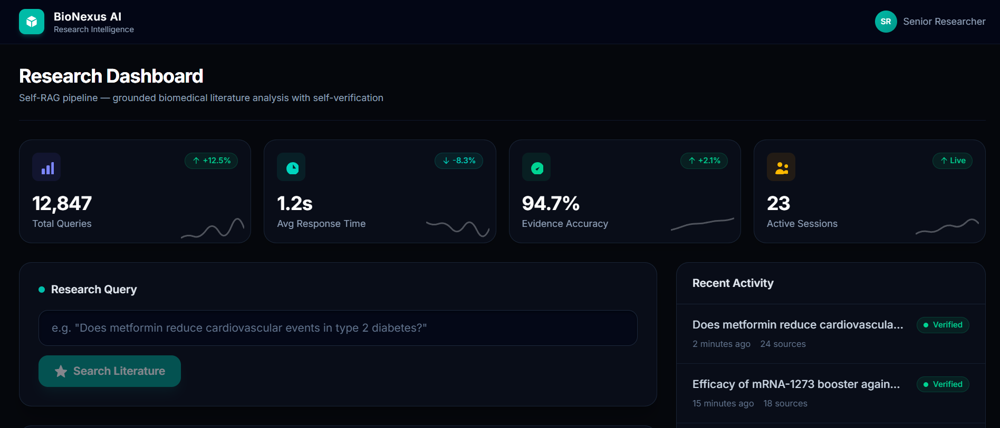
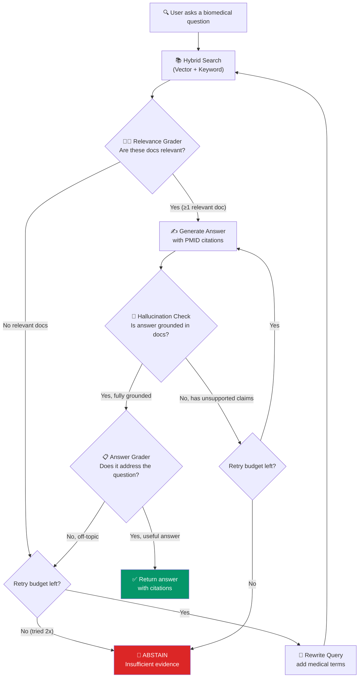
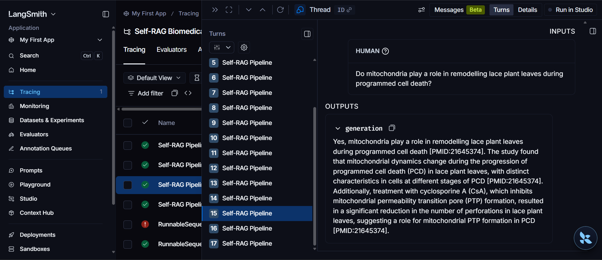
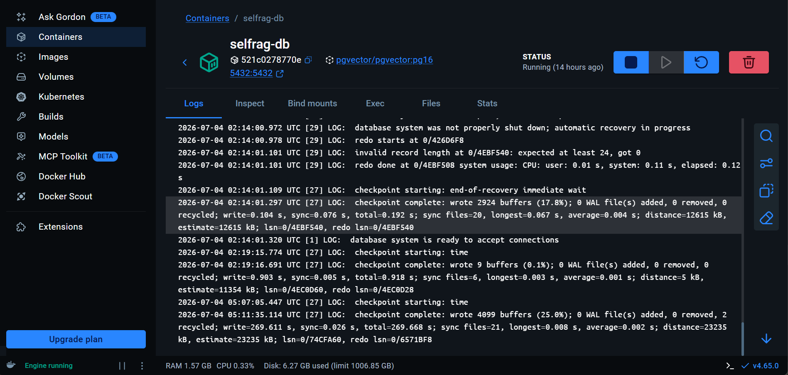

# 🧬 Self-RAG: Biomedical Research Assistant

> A **Self-Reflective Retrieval-Augmented Generation** pipeline that answers biomedical questions using PubMed literature — and *knows when it doesn't know*.

Unlike a basic RAG chatbot that blindly returns whatever the LLM generates, this system **grades its own evidence, checks itself for hallucinations, and refuses to answer when the evidence is insufficient**. That's the "Self" in Self-RAG.



---

## Table of Contents

- [Why Self-RAG? (The Problem with Naive RAG)](#why-self-rag-the-problem-with-naive-rag)
- [How It Works](#how-it-works)
- [Architecture](#architecture)
- [Tech Stack](#tech-stack)
- [Project Structure](#project-structure)
- [Getting Started](#getting-started)
- [Evaluation](#evaluation)
- [Observability](#observability)
- [CI/CD](#cicd)
- [Screenshots](#screenshots)

---

## Why Self-RAG? (The Problem with Naive RAG)

A **naive RAG** system works like this:

```
User Question → Retrieve Documents → Pass to LLM → Return Answer
```

That's fine for casual use, but it has serious problems in high-stakes domains like biomedical research:

| Problem | What Goes Wrong |
|---|---|
| **No quality check** | The LLM gets 10 documents, but none of them are actually relevant. It generates an answer anyway using its training data — a hallucination. |
| **No source verification** | The answer sounds confident and cites a paper, but the claim isn't actually in that paper. |
| **Never says "I don't know"** | Even when the retrieved literature has nothing useful, naive RAG will always produce *something*. In medicine, a confident wrong answer is worse than no answer. |

**Self-RAG fixes all three.** It adds a loop of self-reflection after every step:

| Self-RAG Step | What It Does |
|---|---|
| **Relevance Grading** | After retrieval, an LLM judge scores each document: "Is this actually relevant to the question?" Irrelevant docs are thrown out. |
| **Hallucination Check** | After generating an answer, a second LLM call checks: "Is every claim in this answer actually supported by the source documents?" |
| **Answer Usefulness** | A third check asks: "Does this answer actually address what the user asked?" |
| **Abstention** | If the evidence isn't good enough at any stage, the system says so honestly instead of guessing. |

---

## How It Works

Here's the full decision flow. Every diamond is a point where the system reflects on its own output:



**What makes this "Self-RAG" and not just "RAG with extra steps":**

1. **The LLM evaluates its own retrieval** — it doesn't trust the search engine blindly
2. **The LLM fact-checks its own generation** — every claim is verified against sources
3. **The system has a principled abstention mechanism** — it won't guess in medical contexts
4. **The graph can loop** — if the first retrieval misses, it reformulates the query and tries again (up to 2 retries)

---

## Architecture

```
┌─────────────────────────────────────────────────────────────────────┐
│                         React Frontend (Vite)                       │
│            Glassmorphic dark UI · SSE streaming · Tailwind          │
│                         localhost:5173                               │
└───────────────────────────────┬─────────────────────────────────────┘
                                │ POST /ask/stream (SSE)
                                ▼
┌─────────────────────────────────────────────────────────────────────┐
│                      FastAPI Backend Service                        │
│  ┌──────────────┐  ┌────────────────┐  ┌─────────────────────────┐ │
│  │ Rate Limiter  │  │  Groq Queue    │  │  LangSmith Tracing      │ │
│  │ (per-IP RPM)  │  │  (concurrency  │  │  (every LLM call is     │ │
│  │              │  │   + RPM budget) │  │   auto-traced)          │ │
│  └──────────────┘  └────────────────┘  └─────────────────────────┘ │
│                                                                     │
│  ┌──────────────────────────────────────────────────────────────┐   │
│  │              LangGraph State Machine (Self-RAG)              │   │
│  │                                                              │   │
│  │  retrieve → grade_docs → generate → hallucination_check      │   │
│  │      ↑          │              │            │                │   │
│  │      └── rewrite_query ◄──────┘      grade_answer            │   │
│  │                                         │                    │   │
│  │                                    abstain (if needed)       │   │
│  └──────────────────────────────────────────────────────────────┘   │
│                         localhost:8000                               │
└──────────┬──────────────────────────────────┬───────────────────────┘
           │                                  │
           ▼                                  ▼
┌─────────────────────┐          ┌──────────────────────┐
│  PostgreSQL + pgvector │        │   Groq API            │
│                     │          │                      │
│  • 3,500+ PubMed    │          │  Grader:  llama-3.1  │
│    abstracts         │          │           -8b-instant│
│  • 1024-dim vectors  │          │                      │
│    (Jina v3)        │          │  Generator: llama-3.3│
│  • HNSW index       │          │           -70b       │
│  • GIN full-text    │          │                      │
│    index            │          │                      │
└─────────────────────┘          └──────────────────────┘
```

### Key Design Decisions

| Decision | Why |
|---|---|
| **Two separate LLM models** | The grader (8B) is fast and cheap for yes/no decisions. The generator (70B) is larger and better at synthesizing nuanced answers. |
| **Hybrid search (vector + keyword)** | Vector search catches semantic similarity ("heart attack" ≈ "myocardial infarction"). Keyword search catches exact terms the user typed. RRF fuses both ranked lists. |
| **Whole-abstract chunking** | PubMed abstracts are 150-300 words. Splitting them into smaller chunks would break the reasoning chain that connects intervention → outcome. |
| **Jina Embeddings v3 (API)** | Top of the MTEB leaderboard for retrieval. Using the API is 100-1000x faster than running a local model on CPU. |
| **Abstention as a feature** | In biomedical QA, a confident wrong answer is dangerous. The system explicitly says "I don't know" when it can't find solid evidence — this is a design choice, not a failure. |

---

## Tech Stack

| Layer | Technology | Purpose |
|---|---|---|
| **Frontend** | React 19 + TypeScript + Vite + Tailwind CSS 4 | Dark-themed research dashboard with SSE streaming |
| **Backend** | FastAPI + Uvicorn | Async REST API with rate limiting |
| **Pipeline** | LangGraph | State machine orchestrating the Self-RAG loop |
| **LLM** | Groq (Llama 3.1 8B + Llama 3.3 70B) | Inference via Groq's fast API |
| **Embeddings** | Jina Embeddings v3 (1024-dim) | Dense vector representations for semantic search |
| **Database** | PostgreSQL 16 + pgvector | Vector storage, HNSW index, full-text search |
| **Observability** | LangSmith | Traces every LLM call, grading decision, and pipeline path |
| **CI/CD** | GitHub Actions | Lint, test, RAGAS quality gate, Docker deploy |
| **Containers** | Docker Compose | Two-container setup (backend + PostgreSQL) |
| **Testing** | pytest + RAGAS evaluation harness | Unit tests + automated evaluation on PubMedQA labeled set |
| **Load Testing** | Locust | Simulates 100+ concurrent users |

---

## Project Structure

```
Self-RAG/
├── backend/
│   ├── app/
│   │   ├── api/                    # FastAPI endpoints + rate limiting
│   │   │   ├── main.py             # POST /ask, POST /ask/stream, GET /health
│   │   │   └── queue.py            # Per-IP rate limiter + global Groq queue
│   │   ├── rag/                    # The Self-RAG pipeline
│   │   │   └── graph.py            # LangGraph state machine (the core logic)
│   │   ├── retrieval/              # Search and data ingestion
│   │   │   ├── db.py               # PostgreSQL connection pool + queries
│   │   │   ├── embeddings.py       # Jina Embeddings API client
│   │   │   ├── hybrid_search.py    # Dense + keyword search with RRF fusion
│   │   │   ├── ingest.py           # PubMedQA corpus ingestion (211k rows)
│   │   │   └── schema.sql          # Database schema (vectors + tsvector)
│   │   ├── llm/                    # LLM abstraction
│   │   │   └── client.py           # Groq provider with structured output
│   │   ├── eval/                   # Evaluation harness
│   │   │   └── run_eval.py         # RAGAS metrics on PubMedQA labeled set
│   │   └── observability/          # Tracing
│   │       └── tracing.py          # LangSmith integration
│   ├── tests/                      # Unit tests
│   └── Dockerfile                  # Multi-stage production build
├── frontend/
│   └── src/
│       ├── App.tsx                 # Main dashboard layout
│       └── components/             # Navbar, AskForm, AnswerCard, KPICards, etc.
├── Images/                         # Screenshots for documentation
├── docker-compose.yml              # Backend + PostgreSQL containers
├── requirements.txt                # Python dependencies (by phase)
├── .github/workflows/
│   ├── ci.yml                      # Lint → Test → RAGAS quality gate
│   └── deploy.yml                  # Build and push Docker image to GHCR
├── .env                           # Environment variables (create from template below)
```

---

## Getting Started

### Prerequisites

- **Docker Desktop** (for PostgreSQL + backend containers)
- **Node.js 20+** (for the frontend dev server)
- **API Keys** (free tiers work):
  - [Groq API Key](https://console.groq.com/) — LLM inference
  - [Jina API Key](https://jina.ai/embeddings/) — text embeddings
  - [LangSmith API Key](https://smith.langchain.com/) — tracing (optional)

### 1. Clone and configure

```bash
git clone https://github.com/NoumanZahid-85/Self-RAG-Bio-Medical-Research-Assistant.git
cd Self-RAG-Bio-Medical-Research-Assistant

# Create `.env` with your API keys (see the Environment Variables section below)
```
```

### 2. Start the containers

```bash
docker compose up -d --build
```

This starts:
- **PostgreSQL + pgvector** on port `5432` (with schema auto-applied)
- **FastAPI backend** on port `8000`

### 3. Ingest the PubMedQA corpus

```bash
# Ingest a sample (5,000 docs — takes ~5 minutes)
docker compose exec backend python -m app.retrieval.ingest

# Optional: also ingest the labeled evaluation set (1,000 docs)
docker compose exec backend python -m app.retrieval.ingest_labeled
```

### 4. Start the frontend

```bash
cd frontend
npm install
npm run dev
```

Open [http://localhost:5173](http://localhost:5173) — you should see the Research Dashboard.

### 5. Try a query

Type a biomedical question, for example:

> *"Does metformin reduce cardiovascular events in type 2 diabetes?"*

The dashboard will stream the pipeline steps in real-time:
1. ✅ Retrieving relevant biomedical literature
2. ✅ Grading retrieved evidence for relevance
3. ✅ Generating grounded answer with citations
4. ✅ Checking for hallucinations against sources
5. ✅ Verifying answer addresses the question

---

## Evaluation

The project includes a full evaluation harness that measures four RAGAS-inspired metrics against the PubMedQA labeled set (1,000 expert-annotated questions):

```bash
# Run evaluation on 5 questions (quick check)
docker compose exec backend python -m app.eval.run_eval --sample 5

# Run the full 1,000-question evaluation
docker compose exec backend python -m app.eval.run_eval --sample 0
```

| Metric | What It Measures | Threshold |
|---|---|---|
| **Faithfulness** | Is every claim in the answer actually in the source documents? | ≥ 0.85 |
| **Answer Relevancy** | Does the answer address the question that was asked? | ≥ 0.80 |
| **Context Precision** | What fraction of retrieved docs were graded as relevant? | ≥ 0.50 |
| **Context Recall** | Does the retrieved context cover the information needed? | ≥ 0.50 |

The evaluation harness is also used as a **CI quality gate** — PRs that fail the faithfulness or relevancy thresholds are blocked.

---

## Observability

Every pipeline run is traced in **LangSmith**, giving full visibility into:
- Which documents were retrieved and how they were graded
- The exact LLM prompts and responses at each step
- Which graph path was taken (happy path vs. retry vs. abstain)
- Token usage and latency per step



---

## CI/CD

### Pull Request Pipeline (`ci.yml`)

```
Lint (ruff) → Unit Tests (pytest) → Schema Check → Ingest Sample → RAGAS Quality Gate
```

The quality gate runs the Self-RAG pipeline on a sample of PubMedQA questions and verifies that faithfulness and relevancy exceed the thresholds. **If the LLM starts hallucinating after a code change, the PR gets blocked.**

### Deploy Pipeline (`deploy.yml`)

On merge to `main`, the backend Docker image is built and pushed to GitHub Container Registry (`ghcr.io`).

---

## Screenshots

### Research Dashboard
The glassmorphic dark-themed frontend with KPI cards, query input, and recent activity feed.


### PostgreSQL + pgvector Database
The `selfrag-db` container running PostgreSQL 16 with the pgvector extension, storing 3,500+ embedded PubMed abstracts.



### LangSmith Tracing
Full observability into every pipeline run — inputs, outputs, grading decisions, and the generation with PMID citations.


---

## API Endpoints

| Method | Path | Description |
|---|---|---|
| `POST` | `/ask` | Submit a question, get a JSON response with answer + citations |
| `POST` | `/ask/stream` | Same, but streams pipeline steps via Server-Sent Events |
| `GET` | `/health` | System health: document count, Groq status |

### Example Request

```bash
curl -X POST http://localhost:8000/ask \
  -H "Content-Type: application/json" \
  -d '{"question": "Is Psammaplin A associated with anticancer activity?"}'
```

### Example Response

```json
{
  "answer": "Yes, Psammaplin A is associated with anticancer activity, as it has been demonstrated to have anticancer activity against several human cancer cell lines via the induction of cell cycle arrest and apoptosis [PMID:pubmedqa_artificial_2].",
  "citations": ["pubmedqa_artificial_2", "pubmedqa_artificial_702"],
  "abstained": false,
  "graph_path": ["retrieve", "grade_documents", "generate", "check_hallucination", "grade_answer"]
}
```

---

## Environment Variables

| Variable | Required | Description |
|---|---|---|
| `GROQ_API_KEY` | Yes | Groq API key for LLM inference |
| `JINA_API_KEY` | Yes | Jina API key for text embeddings |
| `DATABASE_URL` | Auto | PostgreSQL connection string (set by Docker Compose) |
| `LANGSMITH_TRACING` | No | Set to `true` to enable LangSmith tracing |
| `LANGSMITH_API_KEY` | No | LangSmith API key |
| `RATE_LIMIT_PER_IP_RPM` | No | Max requests per minute per IP (default: 5) |
| `GROQ_MAX_CONCURRENT` | No | Max concurrent Groq API calls (default: 5) |
| `MAX_DOCS` | No | Limit documents during ingestion (default: 5000) |

---

## License

This project is for educational and portfolio purposes.

---

**Built by [Nouman Zahid](https://github.com/NoumanZahid-85)**
